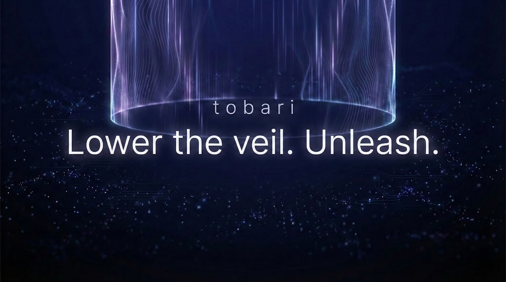
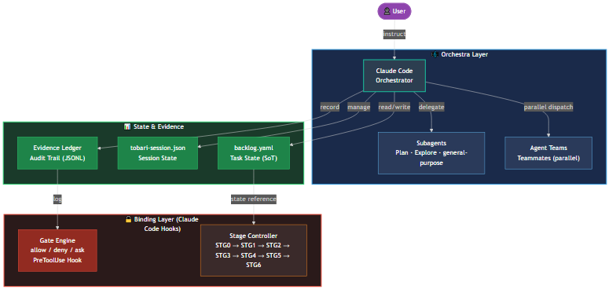
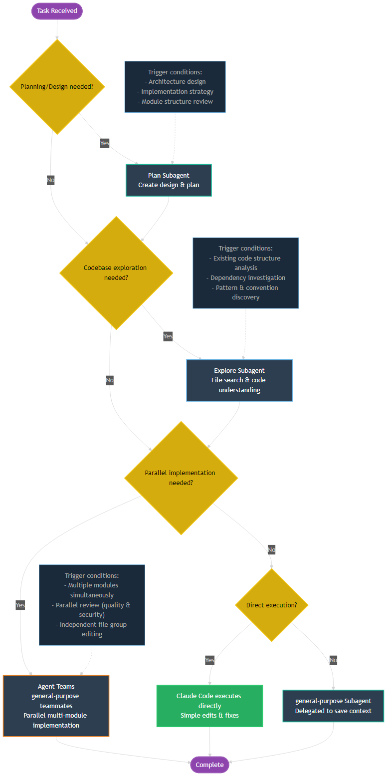
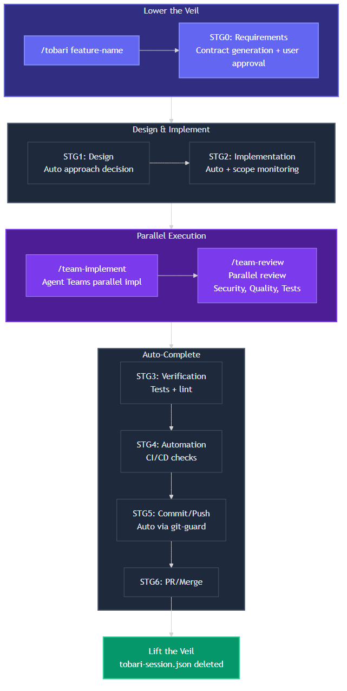
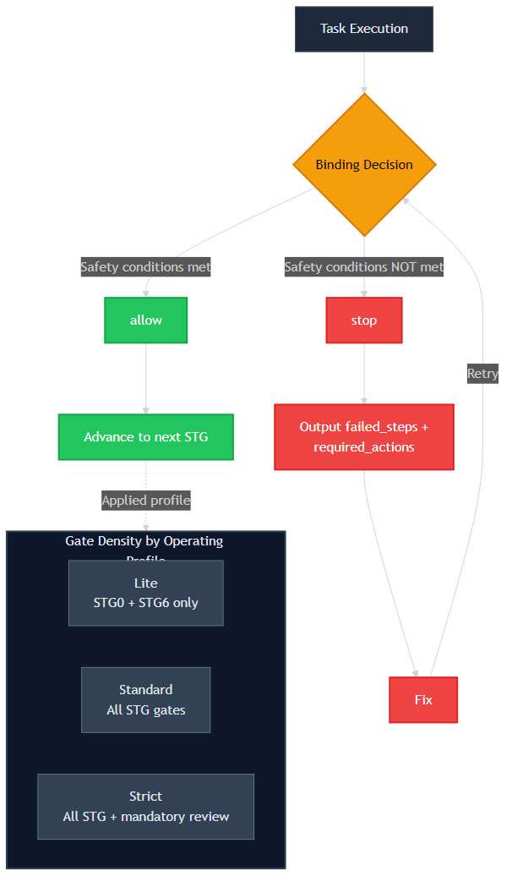
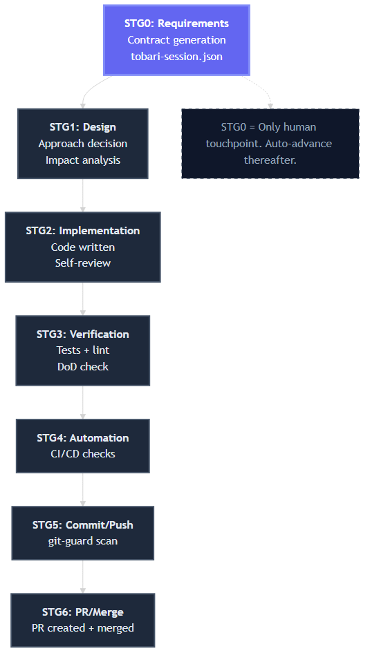

# tobari

> 🌐 [日本語](README_ja.md)



> Lower the veil. Unleash.

An AI agent deleted your files entirely.
It rewrote your tests and claimed "done" -- lying to your face.
You hit "Allow" on every prompt, and your passwords ended up public.

AI agents are powerful. But when they go rogue, the damage is instant and irreversible.

tobari lowers a **veil (barrier)** over your AI agent.
Inside the veil, agents move freely. But they cannot escape it.

**You don't need to understand everything. The veil protects you.**

## Understand in 30 Seconds

1. Run `/tobari` to lower the veil
2. The agent works autonomously
3. No approval fatigue -- the veil auto-approves safe operations
4. The veil blocks dangerous actions automatically (file deletion, secret leaks -- instant block)
5. For uncertain operations, the veil asks you (confirmations decrease over time)
6. Approved operations are remembered -- the veil learns and grows quieter
7. Everything is recorded (fully traceable at any time)

| Pillar         | Concept        | What the Veil Does                                          |
| -------------- | -------------- | ----------------------------------------------------------- |
| 🔒 **Block**   | fail-close     | Auto-blocks destructive operations before they execute      |
| ✅ **Advance** | auto-advance   | Auto-approves safe operations. No dialogs shown to the user |
| 📋 **Record**  | evidence trail | Records all operations as traceable evidence                |

## Prerequisites

| Requirement                           | Version | Purpose                                            |
| ------------------------------------- | ------- | -------------------------------------------------- |
| [Node.js](https://nodejs.org/)        | 18+     | Hooks (veil organs) runtime, `npx tobari init`     |
| [Git](https://git-scm.com/)           | —       | Version control (`git init` required)              |
| [Claude Code](https://claude.ai/code) | —       | Claude Pro $20/month or higher. No API keys needed |

## Quick Start

```bash
# Add tobari to an existing project
npx tobari init

# Lower the veil with Claude Code
/tobari my-feature
```

### Existing .claude/ directory

```bash
# --force: Merges existing settings.json (auto-backup created)
# Existing CLAUDE.md is preserved -- tobari config is appended automatically
npx tobari init --force

# --update: Updates hooks only (rules/skills untouched)
npx tobari init --update
```

## What Does "Lower the Veil" Mean?

"Tobari" is a Japanese word for the curtains that hung in ancient palace chambers, separating the safe interior from the chaos outside.

When you type `/tobari`, a **veil descends** over Claude Code.

Inside the veil, the AI agent writes code, edits files, and runs tests freely. But it cannot reach beyond the veil -- it cannot touch files it shouldn't, run commands it shouldn't, or leak information it shouldn't.

When lowering the veil, you decide just one thing: **what to build**.
Everything else -- safety decisions, operation approvals, evidence recording -- the veil handles for you.

The more you use it, the smarter the veil becomes. It remembers what you've approved and stops asking. Cautious at first, then quietly confident. That's how the veil learns.

## Internationalization (i18n)

tobari supports multiple languages for hook messages. Set the `TOBARI_LANG` environment variable to change the language:

| Language | Value | Description                           |
| -------- | ----- | ------------------------------------- |
| English  | `en`  | Default. All hook messages in English |
| Japanese | `ja`  | All hook messages in Japanese         |

```bash
# Use Japanese messages
export TOBARI_LANG=ja

# Or set in tobari-session.json
# { "lang": "ja" }
```

Language detection priority: `TOBARI_LANG` env var > `tobari-session.json` `lang` field > default (`en`).

## Architecture



tobari has a two-layer structure:

- **Orchestra Layer**: Claude Code orchestrates everything. Subagents and Agent Teams handle parallel execution.
- **Binding Layer**: Governance control. STG gates enforce quality, fail-close blocks unsafe actions, and evidence recording keeps a full audit trail.

### Agent Roles

| Agent                    | Role                  | Use For                                         |
| ------------------------ | --------------------- | ----------------------------------------------- |
| Claude Code (Main)       | Orchestrator          | User interaction, task management, code editing |
| Plan Subagent            | Design Planning       | Implementation strategy                         |
| Explore Subagent         | Code Exploration      | File search, codebase understanding             |
| general-purpose Subagent | Implementation        | Code implementation, file operations            |
| Agent Teams Teammates    | Parallel Coordination | /team-implement, /team-review                   |



## Directory Structure

```
tobari/
├── .claude/
│   ├── hooks/          # Veil Hooks (auto-approve, block, evidence recording)
│   ├── skills/         # Skill definitions (/tobari, /team-implement, etc.)
│   ├── rules/          # Coding, security, and language rules
│   └── settings.json   # Permission settings
├── .githooks/          # Git security hooks (pre-commit, pre-push)
├── CLAUDE.md           # Project configuration (read by Claude Code)
└── NOTICE              # License attribution
```

## Workflow



1. **`/tobari feature-name`** -- Lower the veil (STG0: Contract generation)
2. **Design & Implementation** -- Agent executes automatically (STG1-STG2)
3. **`/team-implement`** -- Parallel implementation with Agent Teams (optional)
4. **`/team-review`** -- Parallel review (security, quality, tests)
5. **Auto-complete** -- Tests, CI, commit, PR flow automatically (STG3-STG6)

## Profiles

| Profile      | Gate Density                     | Use When                                    |
| ------------ | -------------------------------- | ------------------------------------------- |
| **Lite**     | STG0 + STG6 only                 | Low-risk tasks (docs, minor edits)          |
| **Standard** | All STG gates                    | Normal development tasks                    |
| **Strict**   | All STG gates + mandatory review | Security-sensitive or public-facing changes |

Profile is auto-selected based on task risk level at `/tobari` time.

## Binding (Governance)



Binding is the governance control layer. It is not an LLM -- it is a set of rules, gates, and contracts that enforce safety and quality.

### STG Gates (Stage Gates)

| Gate | Name           | Purpose                                                    |
| ---- | -------------- | ---------------------------------------------------------- |
| STG0 | Requirements   | Task acceptance criteria confirmed (only human touchpoint) |
| STG1 | Design         | Architecture/approach reviewed                             |
| STG2 | Implementation | Code written and self-reviewed                             |
| STG3 | Verification   | Tests pass, lint clean                                     |
| STG4 | Automation     | CI/CD checks pass                                          |
| STG5 | Commit/Push    | Changes committed and pushed                               |
| STG6 | PR/Merge       | Pull request created and merged                            |



### fail-close Principle

When safety conditions are NOT met, Binding **stops execution immediately**. It outputs the reason and recovery steps, then waits. No gate is ever skipped -- if a condition fails, the pipeline halts until the issue is resolved.

## Skills

| Skill                   | Command           | Description                                           |
| ----------------------- | ----------------- | ----------------------------------------------------- |
| Lower the Veil          | `/tobari`         | Lower the veil and start a project                    |
| Immune System           | `/tobari-immune`  | Detect bypass patterns and auto-patch vulnerabilities |
| Self-Evolution          | `/tobari-evolve`  | Track official API changes and keep tobari up-to-date |
| Parallel Implementation | `/team-implement` | Parallel implementation with Agent Teams              |
| Parallel Review         | `/team-review`    | Parallel review with Agent Teams                      |
| Design Planning         | `/plan`           | Create an implementation plan                         |
| Test-Driven Development | `/tdd`            | RED-GREEN-REFACTOR cycle                              |
| Code Simplification     | `/simplify`       | Reduce code complexity                                |
| Session Handoff         | `/handoff`        | Save and hand off session state                       |

## Hooks

The veil is composed of 13 "organs" that work together to provide autonomous, safe operation:

| Organ      | Name              | Hook                                                | Role                                                   |
| ---------- | ----------------- | --------------------------------------------------- | ------------------------------------------------------ |
| 🫀 Heart   | Permission Engine | `tobari-gate.js`                                    | Auto-approves safe ops, auto-blocks dangerous ops      |
| 👁️ Eye     | Observer          | `tobari-evidence.js` / `tobari-evidence-failure.js` | Records all operations as evidence (success + failure) |
| 👄 Mouth   | Communicator      | `tobari-permission.js`                              | Contextual permission dialogs, GitHub PR notifications |
| 🛡️ Shield  | Boundary Guard    | `tobari-injection-guard.js`                         | Detects secret leaks, blocks boundary violations       |
| ✋ Hand    | Git Automation    | `tobari-stop.js`                                    | Automates commit, push, PR, merge                      |
| 🦿 Leg     | Self-Healer       | `tobari-stop.js`                                    | Auto-fixes test failures (up to 3 retries)             |
| 🧠 Memory  | State Keeper      | `tobari-session-start.js` / `tobari-precompact.js`  | Preserves context across sessions                      |
| 👛 Wallet  | Cost Controller   | `tobari-cost.js`                                    | Monitors token usage, warns on budget limits           |
| 🦠 Immune  | Input Guard       | `tobari-user-prompt.js`                             | Detects prompt injection at input level                |
| 🧬 DNA     | Subagent Guard    | `tobari-subagent-start.js`                          | Injects security context into subagents                |
| 🔄 Restore | Context Restorer  | `tobari-postcompact.js`                             | Restores contract state after compaction               |
| 📊 Stats   | Session Closer    | `tobari-session-end.js`                             | Records session statistics at exit                     |
| 🧪 Evolve  | Self-Evolution    | `/tobari-evolve` skill                              | Tracks official API changes, auto-upgrades             |

In addition, **git-guard** (pre-commit/pre-push hooks) provides secret scanning as a final boundary defense.

## Skill Auto-Trigger

After lowering the veil (`/tobari`), tobari automatically suggests the next skill to run as you advance through STG gates. No manual invocation needed -- the system guides you through the entire workflow.

| Gate Completed | Suggested Skill                       | Purpose                                    |
| -------------- | ------------------------------------- | ------------------------------------------ |
| STG0           | `/plan`                               | Create implementation plan                 |
| STG1           | `/tdd` or `/team-implement`           | Start TDD or parallel implementation       |
| STG2           | `/simplify` then `/team-review`       | Simplify code, then review                 |
| STG3           | `/test-coverage-improver` then commit | Check coverage, then commit                |
| STG5           | `/docs-sync` then create PR           | Verify docs consistency, then create PR    |
| STG6           | `/checkpointing`                      | Save session records and discover patterns |

Additionally, event-based triggers fire automatically:

| Event      | Condition        | Action                                         |
| ---------- | ---------------- | ---------------------------------------------- |
| Stop       | 3+ denied ops    | Suggests `/tobari-immune` for defense analysis |
| SessionEnd | Incomplete gates | Suggests `/handoff` for session continuity     |

All suggestions are advisory -- they appear in the output but the user (or LLM) decides whether to follow them. Each suggestion fires only once per session to prevent noise.

## Adaptive Security

tobari doesn't just defend -- it **learns and evolves**.

Traditional security tools rely on static rules. When a new attack pattern appears, a human must identify the vulnerability, write a patch, and deploy it. tobari breaks this cycle with two self-improving mechanisms:

### Immune System (`/tobari-immune`)

Like a biological immune system, tobari remembers every attack it encounters and creates "antibodies" to prevent the same attack from succeeding again.

1. **Detection**: Analyzes the evidence ledger for bypass patterns (e.g., Edit blocked, then Bash attempted on the same file)
2. **Diagnosis**: Classifies the attack vector (tool bypass, scope probing, evasion, injection)
3. **Antibody Generation**: Proposes patches to close the vulnerability (new detection rules + tests)
4. **Memory**: Records learned patterns in `immune-memory.jsonl` so they are never forgotten

### Self-Evolution (`/tobari-evolve`)

tobari automatically tracks changes to the Claude Code API and keeps itself current.

1. **Monitor**: Fetches the latest official documentation (hooks, permissions, security)
2. **Compare**: Diffs current implementation against the official spec
3. **Report**: Categorizes findings as Required (deprecated/breaking), Recommended (security), or Info (new features)
4. **Auto-fix**: Safe changes (like deprecated syntax migration) are applied automatically; larger changes require user approval

## Disclaimer

tobari is a risk-mitigation tool and does not guarantee complete safety. It detects and blocks dangerous operations based on known patterns, but cannot prevent all threats. When using tobari with critical systems, maintain proper backups and review processes in addition to tobari. This software is provided "AS IS" under the MIT License.

## Attribution

This project incorporates work from [claude-code-orchestra](https://github.com/DeL-TaiseiOzaki/claude-code-orchestra) by Taisei Ozaki, licensed under the MIT License. See [NOTICE](NOTICE) file for details.
