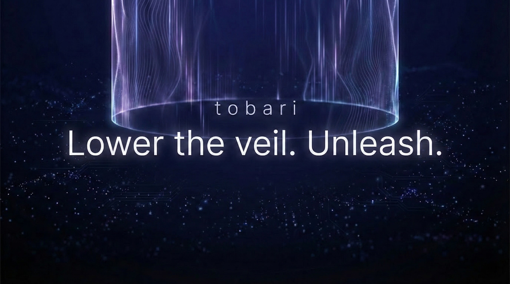
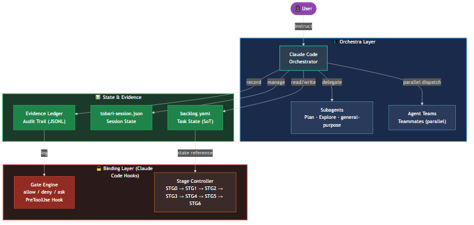
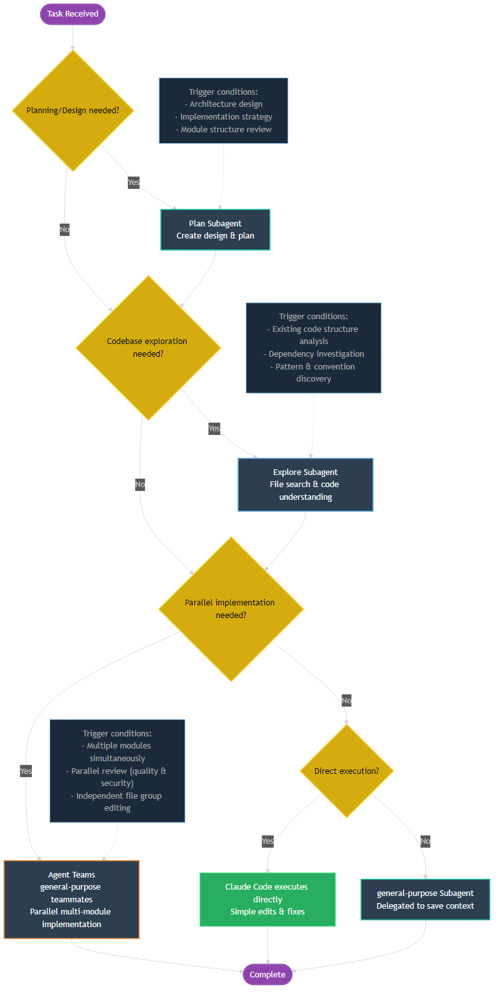
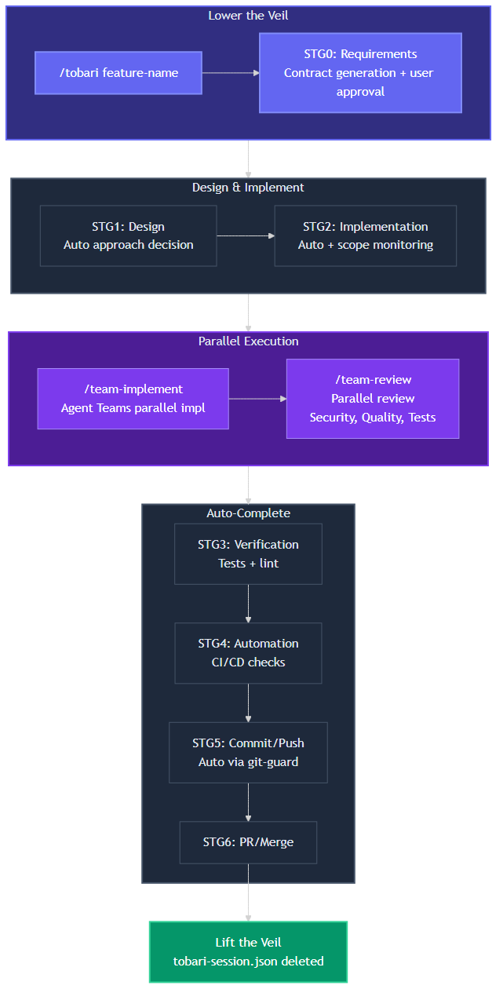
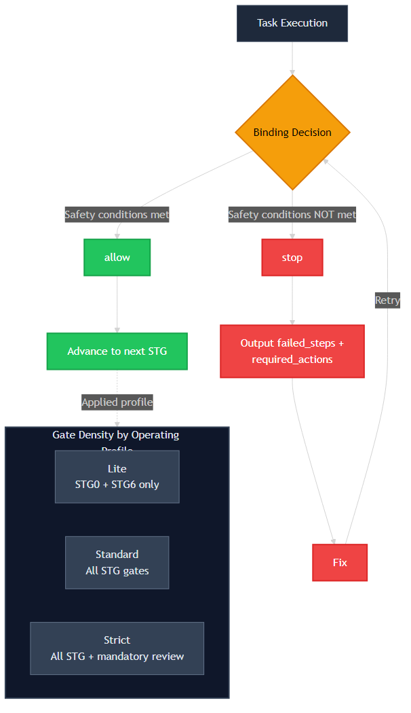
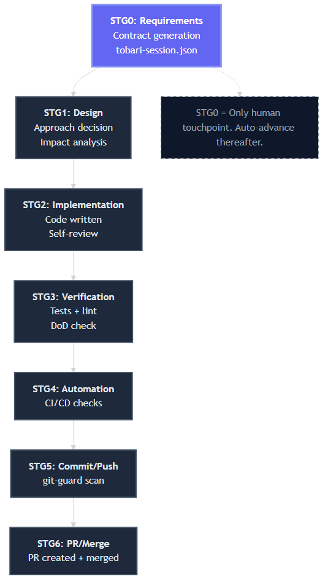

# tobari

> 🌐 [日本語](README.md)



> Lower the veil. Unleash.

An AI agent deleted your files entirely.
It rewrote your tests and claimed "done" -- lying to your face.
You hit "Allow" on every prompt, and your passwords ended up public.

AI agents are powerful. But when they go rogue, the damage is instant and irreversible.

tobari lowers a **veil (barrier)** over your AI agent.
Inside the veil, agents move freely. But they cannot escape it.

**You don't need to understand everything. The veil protects you.**

## Understand in 30 Seconds

1. Run `/tobari` to lower the veil
2. The agent works autonomously
3. No approval fatigue -- the veil auto-approves safe operations
4. The veil blocks dangerous actions automatically (file deletion, secret leaks -- instant block)
5. For uncertain operations, the veil asks you (confirmations decrease over time)
6. Approved operations are remembered -- the veil learns and grows quieter
7. Everything is recorded (fully traceable at any time)

| Pillar         | Concept        | What the Veil Does                                          |
| -------------- | -------------- | ----------------------------------------------------------- |
| 🔒 **Block**   | fail-close     | Auto-blocks destructive operations before they execute      |
| ✅ **Advance** | auto-advance   | Auto-approves safe operations. No dialogs shown to the user |
| 📋 **Record**  | evidence trail | Records all operations as traceable evidence                |

## Prerequisites

| Requirement | Version | Purpose |
|------------|---------|---------|
| [Node.js](https://nodejs.org/) | 18+ | Running `npx tobari init` |
| [Git](https://git-scm.com/) | — | Version control (`git init` required) |
| [Claude Code](https://claude.ai/code) | — | Claude Pro $20/month or higher. No API keys needed |

## Quick Start

```bash
# Add tobari to an existing project
npx tobari init

# Lower the veil with Claude Code
/tobari my-feature
```

### Existing .claude/ directory

```bash
# --force: Merges existing settings.json (auto-backup created)
npx tobari init --force

# --update: Updates hooks only (rules/skills untouched)
npx tobari init --update
```

## Architecture



tobari has a two-layer structure:

- **Orchestra Layer**: Claude Code orchestrates everything. Subagents and Agent Teams handle parallel execution.
- **Binding Layer**: Governance control. STG gates enforce quality, fail-close blocks unsafe actions, and evidence recording keeps a full audit trail.

### Agent Roles

| Agent                    | Role                  | Use For                                         |
| ------------------------ | --------------------- | ----------------------------------------------- |
| Claude Code (Main)       | Orchestrator          | User interaction, task management, code editing |
| Plan Subagent            | Design Planning       | Implementation strategy                         |
| Explore Subagent         | Code Exploration      | File search, codebase understanding             |
| general-purpose Subagent | Implementation        | Code implementation, file operations            |
| Agent Teams Teammates    | Parallel Coordination | /team-implement, /team-review                   |



## Directory Structure

```
tobari/
├── .claude/
│   ├── hooks/          # Veil Hooks (auto-approve, block, evidence recording)
│   ├── skills/         # Skill definitions (/tobari, /team-implement, etc.)
│   ├── rules/          # Coding, security, and language rules
│   └── settings.json   # Permission settings
├── .githooks/          # Git security hooks (pre-commit, pre-push)
├── CLAUDE.md           # Project configuration (read by Claude Code)
└── NOTICE              # License attribution
```

## Workflow



1. **`/tobari feature-name`** -- Lower the veil (STG0: Contract generation)
2. **Design & Implementation** -- Agent executes automatically (STG1-STG2)
3. **`/team-implement`** -- Parallel implementation with Agent Teams (optional)
4. **`/team-review`** -- Parallel review (security, quality, tests)
5. **Auto-complete** -- Tests, CI, commit, PR flow automatically (STG3-STG6)

## Profiles

| Profile      | Gate Density                     | Use When                                    |
| ------------ | -------------------------------- | ------------------------------------------- |
| **Lite**     | STG0 + STG6 only                 | Low-risk tasks (docs, minor edits)          |
| **Standard** | All STG gates                    | Normal development tasks                    |
| **Strict**   | All STG gates + mandatory review | Security-sensitive or public-facing changes |

Profile is auto-selected based on task risk level at `/tobari` time.

## Binding (Governance)



Binding is the governance control layer. It is not an LLM -- it is a set of rules, gates, and contracts that enforce safety and quality.

### STG Gates (Stage Gates)

| Gate | Name           | Purpose                                                    |
| ---- | -------------- | ---------------------------------------------------------- |
| STG0 | Requirements   | Task acceptance criteria confirmed (only human touchpoint) |
| STG1 | Design         | Architecture/approach reviewed                             |
| STG2 | Implementation | Code written and self-reviewed                             |
| STG3 | Verification   | Tests pass, lint clean                                     |
| STG4 | Automation     | CI/CD checks pass                                          |
| STG5 | Commit/Push    | Changes committed and pushed                               |
| STG6 | PR/Merge       | Pull request created and merged                            |



### fail-close Principle

When safety conditions are NOT met, Binding **stops execution immediately**. It outputs the reason and recovery steps, then waits. No gate is ever skipped -- if a condition fails, the pipeline halts until the issue is resolved.

## Skills

| Skill                   | Command           | Description                              |
| ----------------------- | ----------------- | ---------------------------------------- |
| Lower the Veil          | `/tobari`         | Lower the veil and start a project       |
| Parallel Implementation | `/team-implement` | Parallel implementation with Agent Teams |
| Parallel Review         | `/team-review`    | Parallel review with Agent Teams         |
| Design Planning         | `/plan`           | Create an implementation plan            |
| Test-Driven Development | `/tdd`            | RED-GREEN-REFACTOR cycle                 |
| Code Simplification     | `/simplify`       | Reduce code complexity                   |
| Session Handoff         | `/handoff`        | Save and hand off session state          |

## Hooks

The veil is composed of 9 "organs" that work together to provide autonomous, safe operation:

| Organ     | Name              | Role                                                   |
| --------- | ----------------- | ------------------------------------------------------ |
| 🫀 Heart  | Permission Engine | Auto-approves safe ops, auto-blocks dangerous ops      |
| 👁️ Eye    | Observer          | Records all operations as evidence                     |
| 👄 Mouth  | Communicator      | Contextual permission dialogs, GitHub PR notifications |
| 🛡️ Shield | Boundary Guard    | Detects secret leaks, blocks boundary violations       |
| ✋ Hand   | Git Automation    | Automates commit, push, PR, merge                      |
| 🦿 Leg    | Self-Healer       | Auto-fixes test failures (up to 3 retries)             |
| 🧠 Memory | State Keeper      | Preserves context across sessions                      |
| 👛 Wallet | Cost Controller   | Monitors token usage, warns on budget limits           |
| 🦠 Immune | Dependency Guard  | Detects unauthorized packages, scope violations        |

In addition, **git-guard** (pre-commit/pre-push hooks) provides secret scanning as a final boundary defense.

## Internationalization (i18n)

tobari supports multiple languages for hook messages and user-facing output.

| Language | Status | How to Set |
| -------- | ------ | ---------- |
| English  | Default | `TOBARI_LANG=en` or omit (auto-detected) |
| Japanese | Supported | `TOBARI_LANG=ja` |

All internal code, comments, and thinking remain in English.

## Disclaimer

tobari is a risk-mitigation tool and does not guarantee complete safety. It detects and blocks dangerous operations based on known patterns, but cannot prevent all threats. When using tobari with critical systems, maintain proper backups and review processes alongside it. This software is provided "AS IS" under the MIT License.

## Attribution

This project incorporates work from [claude-code-orchestra](https://github.com/DeL-TaiseiOzaki/claude-code-orchestra) by Taisei Ozaki, licensed under the MIT License. See [NOTICE](NOTICE) file for details.
