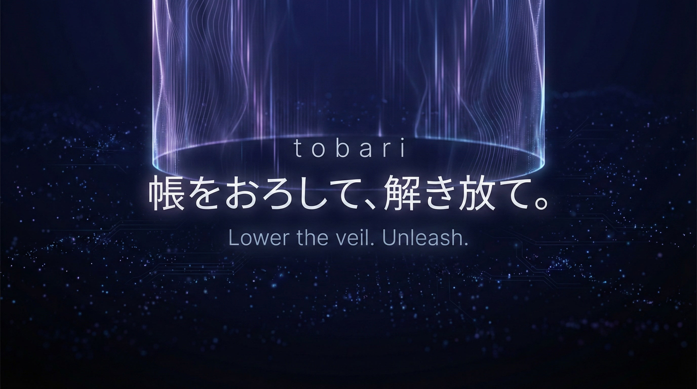
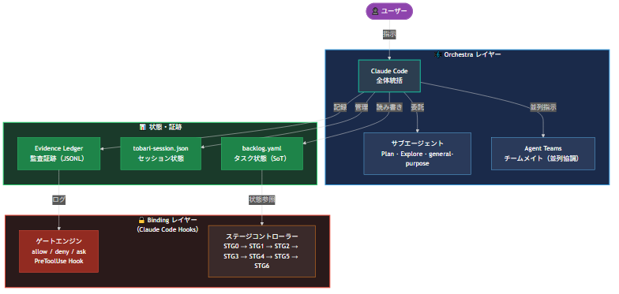
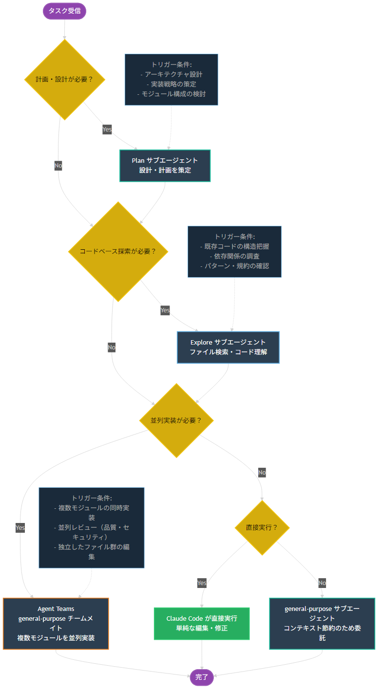
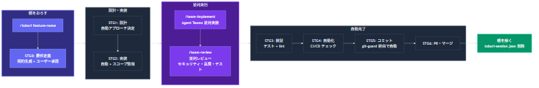
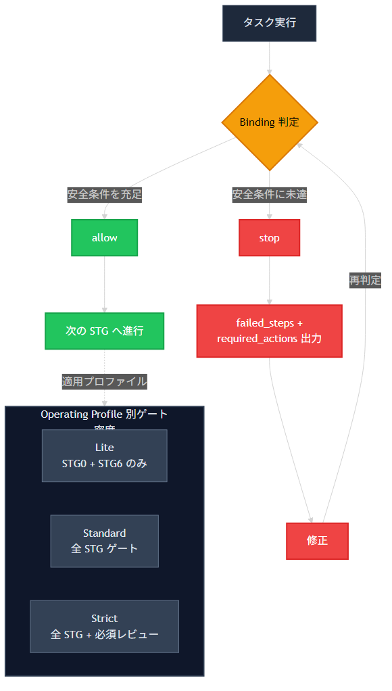
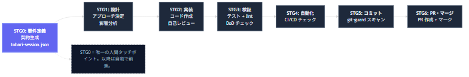

# tobari

> 🌐 [English](README.md)



> 帳をおろして、解き放て。

AI にコードを書かせるとき、安全な操作は自動で通し、危険な操作は自動で止め、全てを記録する — Claude Code の安全統制フレームワーク。

AI エージェントは強力だ。しかし暴走すれば、ファイルの全削除も秘密情報の漏洩も一瞬で起きる。
tobari は AI エージェントに **帳（結界）** をおろす。帳の内側では自由に動くが、帳の外には出られない。

**あなたが全てを理解していなくても、帳がリスクを減らす。**

## 30秒でわかる

1. `/tobari` で帳をおろす
2. エージェントが自動で動く
3. わずらわしい承認は不要。帳が安全な操作を自動承認する
4. 異常時だけ帳が止める（ファイル全削除、秘密情報の漏洩 → 自動ブロック）
5. 帳が判断できない操作はあなたに確認する（使い込むほど確認は減っていく）
6. 一度許可した操作は覚える。帳は使うほど賢くなる
7. 何が起きたか全て記録される（いつでも追跡可能）

| 柱            | コンセプト     | 帳がやること                                         |
| ------------- | -------------- | ---------------------------------------------------- |
| 🔒 **止める** | fail-close     | 破壊的操作を事前に自動ブロック                       |
| ✅ **進む**   | auto-advance   | 帳が安全な操作を自動承認。人間にダイアログを見せない |
| 📋 **残す**   | evidence trail | 全操作を証跡として記録、追跡可能                     |

## Prerequisites

| 必要なもの                            | バージョン | 用途                                              |
| ------------------------------------- | ---------- | ------------------------------------------------- |
| [Node.js](https://nodejs.org/)        | 18+        | Hooks（帳の器官）の動作、`npx tobari init` の実行 |
| [Git](https://git-scm.com/)           | —          | バージョン管理（`git init` 済みであること）       |
| [Claude Code](https://claude.ai/code) | —          | Claude Pro $20/月 以上。API キーは不要            |

## Quick Start

```bash
# 既存プロジェクトに tobari を導入
npx tobari init

# Claude Code で帳をおろす
/tobari my-feature
```

### 既存の .claude/ がある場合

```bash
# --force: 既存の settings.json をマージ（バックアップ自動作成）
# 既存の CLAUDE.md は保持され、tobari の設定が自動追記される
npx tobari init --force

# --update: Hooks のみ最新版に更新（rules/skills はそのまま）
npx tobari init --update
```

## アンインストール

```bash
# 確認プロンプトあり
tobari uninstall

# 確認をスキップ
tobari uninstall --yes
```

tobari が管理するファイル（hooks, rules, skills, agents, commands）をすべて削除し、settings.json と CLAUDE.md をクリーンアップし、ランタイム状態を削除します。`.claude/` 内のユーザー独自ファイルは保持されます。

## 帳をおろすとは

「帳（とばり）」は、もともと寝殿造の部屋を仕切る垂れ布のこと。
外の喧騒から守り、内側に安全な空間をつくる — tobari の名はここから来ている。

`/tobari` と入力すると、Claude Code に **帳がおりる**。

帳の内側では、AI エージェントが自由にコードを書き、ファイルを操作し、テストを走らせる。
しかし帳の外 — つまり「触るべきでないファイル」「実行すべきでないコマンド」「漏らすべきでない情報」— には出られない。

帳をおろすとき、あなたは1つだけ決める: **何を作るか**。
それ以外 — 安全の判断、操作の承認、証跡の記録 — は全て帳が引き受ける。

使い込むほど帳は賢くなる。一度許可した操作は覚え、次からは聞かない。
最初は慎重に、やがて静かに。それが帳の学習だ。

## 多言語対応 (i18n)

tobari の Hook メッセージは多言語に対応しています。`TOBARI_LANG` 環境変数で言語を切り替えられます:

| 言語   | 値   | 説明                                       |
| ------ | ---- | ------------------------------------------ |
| 英語   | `en` | デフォルト。全メッセージが英語で表示される |
| 日本語 | `ja` | 全メッセージが日本語で表示される           |

```bash
# 日本語メッセージを使用
export TOBARI_LANG=ja

# または tobari-session.json で設定
# { "lang": "ja" }
```

言語検出の優先順位: `TOBARI_LANG` 環境変数 > `tobari-session.json` の `lang` フィールド > デフォルト (`en`)

## なぜ tobari か

AI エージェントを活用する開発者が増えている。
ターミナルを複数開き、エージェントを並列で走らせ、Issue から PR までを自動化する。
速い。確かに速い。

**速さだけなら、帳（tobari）はいらない。**

- 「複数のエージェントが同時に動いている。誰が何をしているか把握できているか？」
- 「1つが暴走したとき、残りの3つは止まるか？」
- 「誰も見ていないコミットに、秘密情報が混入していないと言い切れるか？」

並列は手段であり、目的ではない。速さを追求するほど、安全の代償は大きくなる。

tobari はこの問いに答える。

| 観点             | 従来のエージェント       | マルチエージェント並列       | tobari                                               |
| ---------------- | ------------------------ | ---------------------------- | ---------------------------------------------------- |
| 実行モデル       | 1エージェント、逐次実行  | 複数プロセスを手動で並列起動 | Claude Code が一元管理、自動で並列                   |
| 承認ダイアログ   | 毎回手動で承認           | プロセスごとに承認が必要     | 帳（tobari）が安全な操作を自動承認                   |
| 安全装置         | ユーザーの目視確認のみ   | 各プロセスに個別設定が必要   | 帳（tobari）が全操作を一括で統制                     |
| 暴走検知         | 承認を見逃したら手遅れ   | 気づいた時にはもう遅い       | 帳（tobari）が事前に止める（fail-close）             |
| 証跡             | なし                     | ログが分散、追跡が困難       | 全操作を1つの証跡に記録                              |
| プラットフォーム | OS を問わない            | ターミナル多重化ツールに依存 | OS を問わない（Windows / Mac / Linux）               |
| 人間の関与       | 承認ダイアログに張り付き | 起動・監視・介入すべて手動   | 帳（tobari）をおろしたら、あとは帳（tobari）が進める |

tobari の設計思想は単純だ。

**速さと安全を選択肢にしない。両方を同時に実現する。**

帳（tobari）の内側では、エージェントが自由に動き、自動で前進する。
帳（tobari）の外に出ようとする操作は、事前に検知してブロックする。
あなたは「何を作るか」だけを決めればいい。あとは帳（tobari）がリスクを減らし、進め、記録する。

**何より、あなたが全てを理解していなくても使える。**

## Architecture



tobari は **Orchestra 層** と **Binding 層** の二層構造で設計されています。

- **Orchestra 層**: Claude Code が全体統括。サブエージェントと Agent Teams で並列実行
- **Binding 層**: ガバナンス統制。STG ゲート・fail-close・証跡記録

### Agent Roles

| Agent                            | Role       | Use For                              |
| -------------------------------- | ---------- | ------------------------------------ |
| Claude Code（メイン）            | 全体統括   | ユーザー対話、タスク管理、コード編集 |
| Plan サブエージェント            | 設計計画   | 実装戦略の策定                       |
| Explore サブエージェント         | コード探索 | ファイル検索、コードベース理解       |
| general-purpose サブエージェント | 実装・委譲 | コード実装、ファイル操作             |
| Agent Teams チームメイト         | 並列協調   | /team-implement, /team-review        |



## Workflow



| Step | コマンド               | 内容                                       | STG       |
| ---- | ---------------------- | ------------------------------------------ | --------- |
| 1    | `/tobari feature-name` | 帳をおろす（契約生成）                     | STG0      |
| 2    | 自動実行               | 設計・実装をエージェントが自動で実行       | STG1-STG2 |
| 3    | `/team-implement`      | Agent Teams で並列実装（オプション）       | STG2      |
| 4    | `/team-review`         | 並列レビュー（セキュリティ・品質・テスト） | STG3      |
| 5    | 自動完了               | テスト・CI・コミット・PR が自動で流れる    | STG3-STG6 |

STG0 だけが唯一の人間タッチポイントです。それ以降は帳が自動で前進させます。
異常が検出された場合のみ、帳が実行を停止し、理由と対処法を日本語で表示します。

## Profiles

| Profile      | ゲート密度                       | 用途                                           |
| ------------ | -------------------------------- | ---------------------------------------------- |
| **Lite**     | STG0 + STG6 のみ                 | 低リスクタスク（ドキュメント修正、軽微な変更） |
| **Standard** | 全 STG ゲート                    | 通常の開発タスク                               |
| **Strict**   | 全 STG ゲート + 人間レビュー必須 | セキュリティに関わる変更、公開向けの変更       |

Profile は `/tobari` 実行時にタスクのリスクレベルに基づいて自動選択されます。

## Binding (Governance)

Binding はガバナンス統制レイヤです。ルール・ゲート・契約の体系で実行を統制します。



### STG Gates

| Gate | Name       | Purpose                                              |
| ---- | ---------- | ---------------------------------------------------- |
| STG0 | 要件定義   | タスクの受け入れ条件確認（唯一の人間タッチポイント） |
| STG1 | 設計       | アーキテクチャ・アプローチのレビュー                 |
| STG2 | 実装       | コード作成とセルフレビュー                           |
| STG3 | 検証       | テスト実行、lint チェック                            |
| STG4 | 自動化     | CI/CD チェック                                       |
| STG5 | コミット   | 変更のコミット・プッシュ                             |
| STG6 | PR・マージ | Pull Request の作成とマージ                          |



### fail-close 原則

安全条件が満たされない場合、Binding が実行を停止します。
停止時には理由と対処法を日本語で出力します。ゲートをスキップすることはありません。

## Skills

| Skill              | Command           | Description                             |
| ------------------ | ----------------- | --------------------------------------- |
| 帳をおろす         | `/tobari`         | 帳をおろしてプロジェクト開始            |
| 免疫システム       | `/tobari-immune`  | バイパスパターン検出・脆弱性の自動修復  |
| 自己進化           | `/tobari-evolve`  | 公式 API 変更の追跡・自動アップグレード |
| 並列実装           | `/team-implement` | Agent Teams で並列実装                  |
| 並列レビュー       | `/team-review`    | Agent Teams で並列レビュー              |
| 計画策定           | `/plan`           | 設計計画を策定                          |
| テスト駆動開発     | `/tdd`            | RED-GREEN-REFACTOR サイクル             |
| コード簡素化       | `/simplify`       | コードの複雑性を削減                    |
| セッション引き継ぎ | `/handoff`        | セッション状態を保存・引き継ぎ          |

## Hooks

帳は13の「器官」で構成されています。それぞれが協調し、ユーザーが操作の詳細を気にせず済む状態を作ります。

| 器官    | 名前                 | Hook                                                | 役割                                             |
| ------- | -------------------- | --------------------------------------------------- | ------------------------------------------------ |
| 🫀 心臓 | 権限判定             | `tobari-gate.js`                                    | 安全な操作を自動承認、危険な操作を自動ブロック   |
| 👁️ 目   | 観測・記録           | `tobari-evidence.js` / `tobari-evidence-failure.js` | 全操作を証跡として記録（成功 + 失敗）            |
| 👄 口   | 対話・通知           | `tobari-permission.js`                              | 確認ダイアログの文脈付加、GitHub PR 完了通知     |
| 🛡️ 盾   | 境界防御             | `tobari-injection-guard.js`                         | 秘密情報の漏洩検出、境界違反のブロック           |
| ✋ 手   | Git 自動操作         | `tobari-stop.js`                                    | commit → push → PR → merge の自動化              |
| 🦿 脚   | 自己修復             | `tobari-stop.js`                                    | テスト失敗時の自動修正（最大3回試行）            |
| 🧠 記憶 | 状態維持             | `tobari-session-start.js` / `tobari-precompact.js`  | セッション横断の文脈保持                         |
| 👛 財布 | コスト制御           | `tobari-cost.js`                                    | トークン消費の監視・警告                         |
| 🦠 免疫 | 入力防御             | `tobari-user-prompt.js`                             | ユーザー入力レベルでのインジェクション検知       |
| 🧬 DNA  | サブエージェント防御 | `tobari-subagent-start.js`                          | サブエージェントへのセキュリティコンテキスト注入 |
| 🔄 復元 | コンテキスト復元     | `tobari-postcompact.js`                             | コンパクション後の契約状態復元                   |
| 📊 統計 | セッション終了       | `tobari-session-end.js`                             | 終了時のセッション統計記録                       |
| 🧪 進化 | 自己進化             | `/tobari-evolve` スキル                             | 公式 API 変更の追跡・自動アップグレード          |

加えて、git-guard（pre-commit / pre-push フック）が秘密情報のスキャンを担当します。

## スキル自動トリガー

帳をおろした後（`/tobari`）、STG ゲートを進めるたびに次に実行すべきスキルが自動で提案されます。手動でコマンドを呼び出す必要はありません。

| 完了ゲート | 提案スキル                           | 目的                                  |
| ---------- | ------------------------------------ | ------------------------------------- |
| STG0       | `/plan`                              | 実装計画を作成                        |
| STG1       | `/tdd` or `/team-implement`          | TDD 実装 or 並列実装を開始            |
| STG2       | `/simplify` → `/team-review`         | コード簡素化後、レビュー開始          |
| STG3       | `/test-coverage-improver` → コミット | カバレッジ確認後、コミット            |
| STG5       | `/docs-sync` → PR 作成               | ドキュメント整合性チェック後、PR 作成 |
| STG6       | `/checkpointing`                     | セッション記録とパターン発見          |

イベントベースのトリガーも自動で発火します:

| イベント   | 条件             | アクション                            |
| ---------- | ---------------- | ------------------------------------- |
| Stop       | deny 3件以上     | `/tobari-immune` で防御分析を提案     |
| SessionEnd | 未完了ゲートあり | `/handoff` でセッション引き継ぎを提案 |

全ての提案はアドバイザリ（助言）です。セッション中に同じ提案は1回だけ表示されます。

## 適応型セキュリティ

tobari はただ防御するだけではありません。**学習し、進化します。**

従来のセキュリティツールは静的なルールに依存しています。新しい攻撃パターンが現れると、人間が脆弱性を特定し、パッチを書いて展開しなければなりません。tobari は2つの自己改善メカニズムでこのサイクルを打破します。

### 免疫システム (`/tobari-immune`)

生物の免疫システムのように、tobari は遭遇したすべての攻撃を記憶し、同じ攻撃が二度と成功しないように「抗体」を作ります。

1. **検出**: 証跡ログからバイパスパターンを分析（例: Edit がブロックされた後、同じファイルに Bash を試行）
2. **診断**: 攻撃ベクトルを分類（ツールバイパス、スコープ探索、回避、インジェクション）
3. **抗体生成**: 脆弱性を塞ぐパッチを提案（新しい検出ルール + テスト）
4. **記憶**: 学習したパターンを `immune-memory.jsonl` に記録し、二度と忘れない

### 自己進化 (`/tobari-evolve`)

tobari は Claude Code API の変更を自動追跡し、常に最新の状態を維持します。

1. **監視**: 最新の公式ドキュメントを取得（hooks、permissions、security）
2. **比較**: 現在の実装と公式仕様の差分を検出
3. **レポート**: 発見を分類（必須: 非推奨/破壊的変更、推奨: セキュリティ改善、情報: 新機能）
4. **自動修正**: 安全な変更（非推奨構文の移行など）は自動適用、大きな変更はユーザー承認を経て適用

## Disclaimer

tobari はリスクを軽減するためのツールであり、完全な安全性を保証するものではありません。既知のパターンに基づいて危険な操作を検出・ブロックしますが、全ての脅威を防ぐことはできません。重要なシステムでの使用時は、tobari に加えて適切なバックアップ・レビュー体制を維持してください。本ソフトウェアは MIT License に基づき「現状のまま（AS IS）」で提供されます。

## Attribution

This project incorporates work from [claude-code-orchestra](https://github.com/DeL-TaiseiOzaki/claude-code-orchestra) by Taisei Ozaki, licensed under the MIT License. See [NOTICE](NOTICE) file for details.
